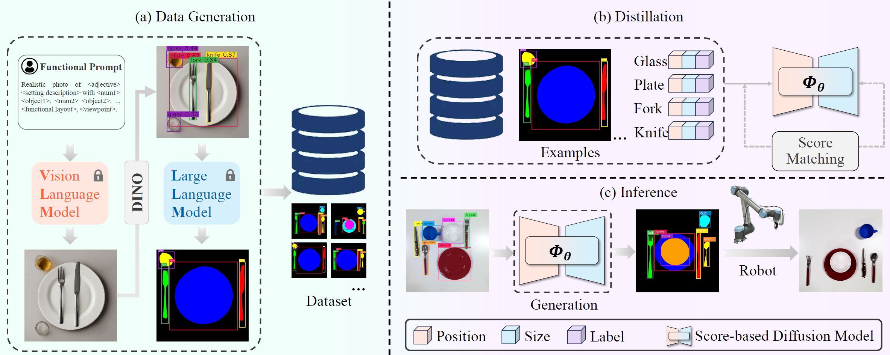

# LVDiffusor: Distilling Functional Rearrangement Priors from Large Models into Diffusor



LVDiffusor distills **functional arrangement knowledge** from **large models** into a **diffusion model** to generate **well-organized** and **compatible layouts** from everyday cluttered scenes.

[](https://sites.google.com/view/lvdiffusion)
[](https://arxiv.org/abs/2312.01474)

## Table of Contents
- [Installation](#installation)
- [Usage](#usage)
- [License](#license)

## Installation

To install the LVDiffusor, follow these steps:

1. Clone the repository:
    ```bash
    git clone https://github.com/yourusername/LVDiffusor.git
    ```
2. Navigate to the project directory:
    ```bash
    cd LVDiffusor
    ```
3. Install the required dependencies:
    ```bash
    pip install -r requirements.txt
    ```

4. The detection module in our work depends on [GroundingDINO](https://github.com/IDEA-Research/Grounded-Segment-Anything). Please check the original repo and complete the setup for local deployment.


## Usage

### Dataset Generation with VLM and LLM ###
We use GPT4 as the large language model, please prepare your keys for requesting the openai api. The config in [data_gen.py](data_gen.py) can be edited for prompting the VLM and LLM.

Generate the layout dataset:
```bash
python data_gen.py --num_samples 100
```

### Training ###
```bash
python training.py --rotation False --scene_name dinning_table
```

### Evaluation ###
To use LVDiffusor, download the checkpoints and run the following command:
```bash
python eval_model.py --log_dir office_desk_left --test_dir test_data --rotation False
```


## License

This project is licensed under the MIT License. See the [LICENSE](LICENSE) file for more information.

## Citation

Please cite our paper using the following BibTeX entry if you find it helpful:

```bibtex
@ARTICLE{lvdiffusor2024,
    author={Zeng, Yiming and Wu, Mingdong and Yang, Long and Zhang, Jiyao and Ding, Hao and Cheng, Hui and Dong, Hao},
    journal={IEEE Robotics and Automation Letters}, 
    title={LVDiffusor: Distilling Functional Rearrangement Priors From Large Models Into Diffusor}, 
    year={2024},
    volume={9},
    number={10},
    pages={8258-8265}
}
```

## Contact

For any questions or inquiries, please contact:

Yiming Zeng: [zengym27@mail2.sysu.edu.cn](mailto:zengym27@mail2.sysu.edu.cn)

Mingdong Wu: [wmingd@pku.edu.cn](mailto:wmingd@pku.edu.cn)
